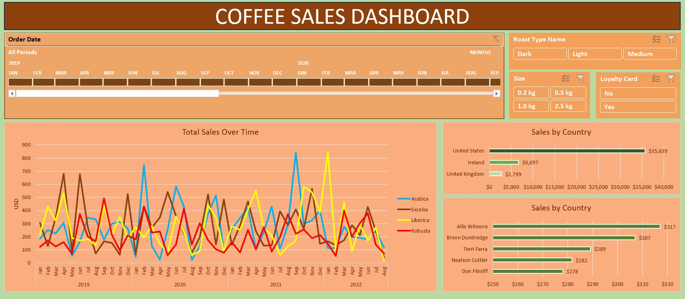

# Coffee Sales Data Analysis Project

#### Preview of Dashboard:

    

## Project Overview

This project involves analyzing a sample dataset of coffee sales to derive actionable insights through data cleaning, transformation, and visualization in Microsoft Excel. The goal was to create an interactive dashboard that provides a clear overview of sales performance, customer behavior, and product trends. This project demonstrates proficiency in data manipulation, advanced Excel functions, and data visualization techniques, showcasing a structured approach to a data analysis workflow. 

The dataset was sourced from: https://github.com/mochen862/excel-project-coffee-sales/blob/main/coffeeOrdersData.xlsx

## Dataset Description

The dataset consists of three tables:

- **Orders**: Contains transactional data, including Order ID, Order Date, Customer ID, product ID, and sales details.
- **Customers**: Includes customer information such as Customer ID, Name, Email, Country, and Loyalty Card Status.
- **Products**: Details product attributes like Product ID, Coffee Type, Roast Type, Size, Unit Price, and Profit.

## Project Objectives

- Clean and preprocess the dataset to ensure data integrity.
- Enrich the Orders table by integrating relevant data from the Customers and Products tables.
- Build an interactive dashboard with PivotTables, PivotCharts, and slicers to visualize key metrics.
- Derive insights to understand sales trends, customer preferences, and product performance.

## Methodology

The project followed a systematic approach, with the following key steps:

### 1. Data Cleaning & Preparation

- **Data Integration**:
  - Used **XLOOKUP** to populate customer-related columns in the Orders table (Customer Name, Email, Country) by referencing the Customers table.
  - Implemented **INDEX MATCH** to dynamically fetch product data (Coffee Type, Roast Type, Size, Unit Price, Sales) from the Products table, using a single dynamic formula to streamline the process.
- **Data Formatting**:
  - Standardized the Date column for consistency.
  - Appended units ("kg") to the Size column and applied currency formatting to price and sales columns for clarity.
- **Duplicate Removal**:
  - Removed duplicates using Excel’s 'Remove Duplicates' tool to ensure data quality.
- **Table Conversion**:
  - Converted the dataset into an Excel Data Table for dynamic referencing and ease of analysis.

### 2. Data Analysis and Visualization

- **PivotTables and PivotCharts**:
  - Created PivotTables to summarize key metrics, such as total sales, sales by country, and customer purchase patterns.
  - Generated PivotCharts to visualize trends, including:
    - **Total Sales Over Time**: A line chart to track sales performance across dates.
    - **Sales by Country**: A bar chart to compare sales across different regions.
    - **Top 5 Customers**: A column chart to highlight the most valuable customers based on total purchases.
- **Slicers and Timeline**:
  - Added interactive slicers for filtering by:
    - Date (via a Timeline slicer)
    - Product Size
    - Loyalty Card Status
    - Roast Type
  - Configured slicers via ***Report Connections*** to synchronize filters across all visualizations.
- **Dashboard Creation**:
  - Designed an interactive dashboard consolidating the visualizations and slicers. The dashboard provides a user-friendly interface to explore sales data, filter by key dimensions, and uncover insights.

## Insights Gained

- **Sales Trends**: Identified seasonal patterns in coffee sales, with peaks during specific months, suggesting opportunities for targeted marketing campaigns.
- **Geographic Performance**: Certain countries contributed disproportionately to sales, indicating potential for region-specific promotions.
- **Customer Behavior**: Loyalty card holders accounted for a significant portion of sales, highlighting the effectiveness of the loyalty program.
- **Product Preferences**: Specific roast types and sizes were more popular, informing inventory and product development strategies.

## Tools and Techniques Used

- **Microsoft Excel**: Data cleaning, transformation, and visualization.
- **Excel Functions**: XLOOKUP, INDEX MATCH for data integration.
- **Features**: Data Tables, PivotTables, PivotCharts, Slicers, Timeline, Remove Duplicates.
- **Dashboard Design**: Interactive visualization layout for stakeholder engagement.

## Key Learnings

- **Data Integration**: Gained proficiency in using XLOOKUP and INDEX MATCH to merge data from multiple tables efficiently.
- **Dynamic Analysis**: Learned to create dynamic formulas and Data Tables to streamline data processing.
- **Visualization Best Practices**: Understood the importance of interactive elements like slicers and timelines in enhancing user experience.
- **Insight Communication**: Developed skills in translating raw data into actionable business insights through clear visualizations.

## Future Improvements

- Incorporate additional datasets, such as marketing spend or inventory levels, to provide a more holistic analysis.
- Explore advanced visualization tools like Power BI or Tableau to enhance dashboard interactivity.
- Apply statistical analysis to identify correlations between customer demographics and purchasing behavior.

## Conclusion

This project demonstrates a robust data analysis workflow, from cleaning to visualization, using Excel to deliver actionable insights. It reflects my ability to handle complex datasets, create engaging dashboards, and communicate findings effectively

---

Feel free to connect with me on LinkedIn or explore my other projects on GitHub!
