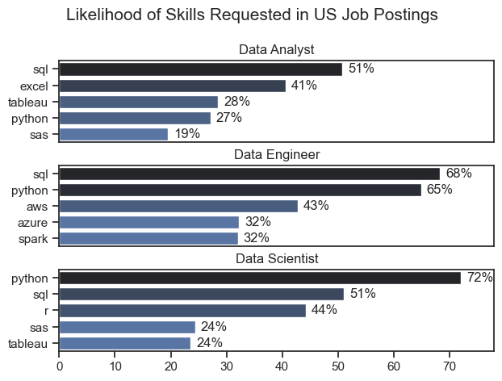
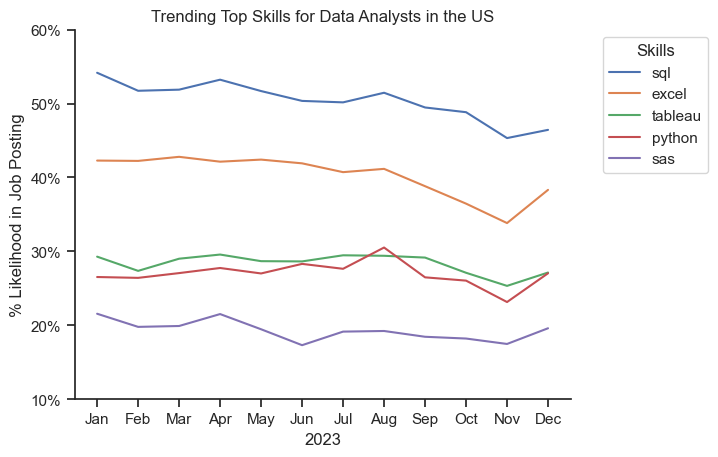
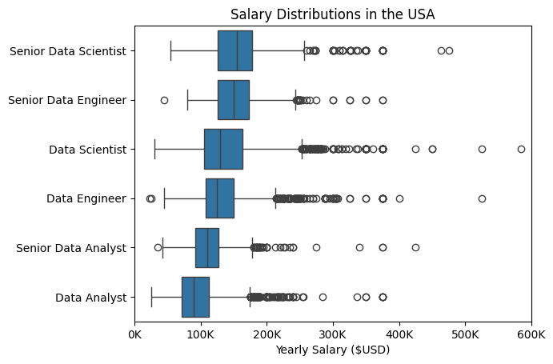
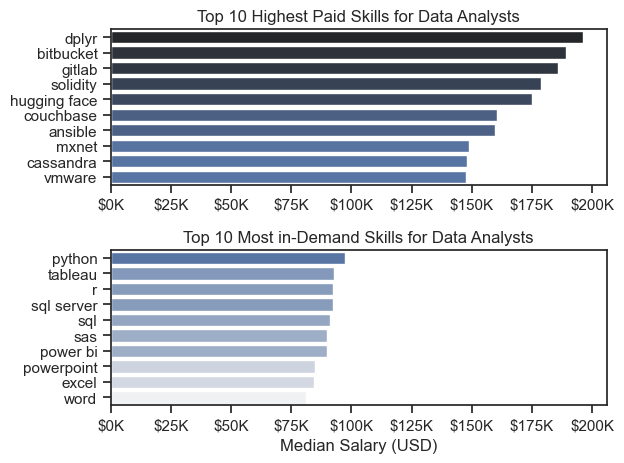
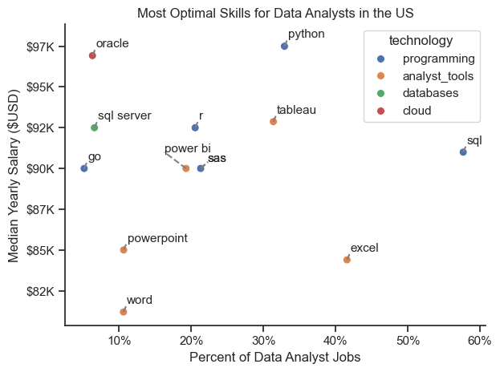

# Data Job Market Analysis

Welcome to my analysis of the data job market, focusing on data analyst roles. This project was created out of a desire to navigate and understand the job market more effectively as well as to aid me in my job search. It delves into top-paying and in-demand skills to help find optimal job opportunities for data analysts.

The data is sourced from [HuggingFace (Author: Luke Barousse)](https://huggingface.co/datasets/lukebarousse/data_jobs) which provides a foundation for my analysis. It contains detailed information on data-related job postings, salaries, locations, and essential skills. Through a series of Python scripts, I explore key questions such as the most demanded skills, salary trends, and the intersection of demand and salary in data analytics.

*Note: The dataset used in this analysis contains job postings exclusively from 2023.*

# The Questions

Below are the questions I want to answer in my project:

1. What are the most in-demand skills for the top 3 most popular data roles?
2. How are in-demand skills trending for Data Analysts?
3. How well do jobs and skills pay for Data Analysts?
4. What are the optimal skills for data analysts to learn? (High Demand AND High Paying) 

# Tools I Used

For my deep dive into the data analyst job market, I harnessed the power of several key tools:

- **Python:** The backbone of my analysis, allowing me to analyze the data and find critical insights. I also used the following Python libraries:
    - **Pandas Library:** This was used to analyze the data. 
    - **Matplotlib Library:** I visualized the data.
    - **Seaborn Library:** Helped me create more advanced visuals. 
- **Jupyter Notebooks:** The tool I used to run my Python scripts which let me easily include my notes and analysis.
- **Visual Studio Code:** My go-to for executing my Python scripts.
- **Git & GitHub:** Essential for version control and sharing my Python code and analysis, ensuring collaboration and project tracking.

# Data Preparation & Cleanup

This section outlines the steps taken to prepare the data for analysis, ensuring accuracy and usability.

## Import & Clean Up Data

I start by importing necessary libraries and loading the dataset, followed by initial data cleaning tasks to ensure data quality.

```python
import seaborn as sns
import pandas as pd
from datasets import load_dataset
import matplotlib.pyplot as plt
import ast 

# Load Datasets
dataset = load_dataset('lukebarousse/data_jobs')
df = dataset['train'].to_pandas()

# Data Cleanup (Datetime & 'job_skills' to list type)
df['job_posted_date'] = pd.to_datetime(df['job_posted_date'])
df['job_skills'] = df['job_skills'].apply(lambda skill_list: ast.literal_eval(skill_list) if pd.notna(skill_list) else skill_list) 
```

## Filter for US Jobs

To focus my analysis on the U.S. job market, I apply filters to the dataset, narrowing down to roles based in the United States.

```python
df_US = df[df['job_country'] == 'United States']
```

# The Analysis

Each Jupyter notebook for this project aimed at investigating specific aspects of the data job market. Here’s how I approached each question:

## 1. What are the most demanded skills for the top 3 most popular data roles?

To find the most demanded skills for the top 3 most popular data roles. I filtered out those positions by which ones were the most popular, and got the top 5 skills for these top 3 roles. This query highlights the most popular job titles and their top skills, showing which skills I should pay attention to depending on the roles I'm targeting.

View my notebook with detailed steps here: [2_Skills_Count.ipynb](Project_Files/2_Skills_Count.ipynb)

### Visualize Data

```python
fig, ax = plt.subplots(len(job_titles), 1) 
sns.set_theme(style='ticks')

for i, job_title in enumerate(job_titles):
    df_plot = df_skills_perc[df_skills_perc['job_title_short'] == job_title].head(5)
    sns.barplot(data=df_plot, x = 'skill_perc', y = 'job_skills', ax=ax[i], hue = 'skill_perc', palette = 'dark:b_r')
    ax[i].set_title(job_title)
    ax[i].set_xlabel('')
    ax[i].set_ylabel('')
    ax[i].set_xlim(0,78) 
    ax[i].legend().set_visible(False)

    if i != len(job_titles) - 1:
        ax[i].set_xticks([]) # Removes the x axis ticks & labels apart from the last subplot

    for n, v in enumerate(df_plot['skill_perc']): # For the % labels for each individual bar
        ax[i].text(v + 1, n, f'{v:.0f}%', va = 'center')

fig.suptitle('Likelihood of Skills Requested in US Job Postings', fontsize = 15)
fig.tight_layout(h_pad=0.5)
plt.show()
```

### Results



*Bar graph visualizing the likelihood for the top 5 skills associated with the top 3 data roles.*

### Insights 

- SQL is the most requested skill for Data Analysts and Data Engineers, with it in over half the job postings for both roles. For Data Scientists, Python is the most sought-after skill, appearing in 72% of job postings.
- Data Engineers require more specialized technical skills (AWS, Azure, Spark) compared to Data Analysts and Data Scientists who are expected to be proficient in more general data management and analysis tools (Excel, Tableau).
- Python is a versatile skill, highly demanded across all three roles, but most prominently for Data Scientists (72%) and Data Engineers (65%).

## 2. How are in-demand skills trending for Data Analysts?

To find how skills are trending in 2023 for Data Analysts, I filtered data analyst positions and grouped the skills by the month of the job postings. This got me the top 5 skills of data analysts by month, showing how popular skills were throughout 2023.

View my notebook with detailed steps here: [3_Skills_Trend.ipynb](Project_Files/3_Skills_Trend.ipynb).

### Visualize Data

```python

# Visualization
df_plot = df_DA_US_perc.iloc[:, :5] # All rows, first 5 columns (skills) of df_DA_US_perc
sns.lineplot(data = df_plot, dashes=False)
sns.set_theme(style='ticks')
sns.despine()

# Titles & Labels
plt.title('Trending Top Skills for Data Analysts in the US')
plt.xlabel('2023')
plt.ylabel('% Likelihood in Job Posting')

# Add a legend outside of the plot area
plt.legend(title='Skills', bbox_to_anchor=(1.05, 1), loc='upper left')

# Format y-axis tick labels to show percentages
from matplotlib.ticker import PercentFormatter, MultipleLocator
plt.gca().yaxis.set_major_formatter(PercentFormatter(decimals=0))
plt.gca().yaxis.set_major_locator(MultipleLocator(10))  # y-tick interval: 10%
plt.ylim(10, 60)

plt.show()

```

### Results



*Bar graph visualizing the trending top skills for data analysts in the US in 2023.*

### Insights:

 - SQL remains the most consistently demanded skill throughout the year, although it shows a gradual decrease in demand.
 - Python and Tableau do not show a strong upward or downward trend, implying that it is valued but may not be as central as SQL or Excel for certain data analyst roles.
 - SAS is more specialized, possibly more common in fields like finance or healthcare where it has a strong legacy.

 ## 3. How well do jobs and skills pay for Data Analysts?

To identify the highest-paying roles and skills, I only got jobs in the United States and looked at their median salary. But first I looked at the salary distributions of common data jobs like Data Scientist, Data Engineer, and Data Analyst, to get an idea of which jobs are paid the most. 

View my notebook with detailed steps here: [4_Salary_Analysis](Project_Files/4_Salary_Analysis.ipynb).

### Visualize Data

```python

sns.boxplot(data=df_US_top6, x = 'salary_year_avg', y = 'job_title_short', order = job_order)

plt.title('Salary Distributions in the USA')
plt.xlabel('Yearly Salary ($USD)')
plt.ylabel('')
plt.gca().xaxis.set_major_formatter(plt.FuncFormatter(lambda x, pos: f'{int(x/1000)}K'))
plt.xlim(0, 600000)
plt.show()

```

### Results



*Box plot visualizing the salary distributions for the top 6 data job titles.*

### Insights

- Senior Data Scientist and Senior Data Engineer roles have the highest median salaries, typically above $150K, and a broad range extending into the $300K+ range, indicating substantial earning potential and variation in pay at senior levels.

- Data Scientist and Data Engineer roles have similar median salaries, generally just under $150K, but with a noticeable spread in the upper ranges, showing high earning potential but more limited than their senior counterparts.

- Data Analyst positions have the lowest median salary among these roles, with most salaries concentrated below $100K, reflecting entry-level or mid-level pay typical for this position.

- Outliers are common across all roles, especially in senior and specialist positions, indicating that a few positions command significantly higher salaries, likely due to specialized skills, company size, or location factors.

### Highest Paid & Most Demanded Skills for Data Analysts

Next, I narrowed my analysis and focused only on data analyst roles. I looked at the highest-paid skills and the most in-demand skills. I used two bar charts to showcase these.

#### Visualize Data

```python

fig, ax = plt.subplots(2, 1)
sns.set_theme(style='ticks')

# 1ST SUBPLOT - Highest Paid Skills
sns.barplot(data=df_DA_top_pay, x='median', y=df_DA_top_pay.index, ax=ax[0], hue='median', palette='dark:b_r')
ax[0].legend().remove()

# df_DA_top_pay.plot(kind='barh', y = 'median', ax = ax[0], legend=False)
ax[0].set_title('Top 10 Highest Paid Skills for Data Analysts')
ax[0].set_xlabel('')
ax[0].set_ylabel('')
ax[0].xaxis.set_major_formatter(plt.FuncFormatter(lambda x, _: f'${int(x/1000)}K'))

# 2ND SUBPLOT - Most In-Demand Skills (Highest Count)
sns.barplot(data=df_DA_skills, x='median', y=df_DA_skills.index, ax=ax[1], hue='median', palette='light:b')
ax[1].legend().remove()

# df_DA_skills.plot(kind='barh', y = 'median', ax = ax[1]) # 
ax[1].set_title('Top 10 Most in-Demand Skills for Data Analysts')
ax[1].set_xlabel('Median Salary (USD)')
ax[1].set_ylabel('')
ax[1].set_xlim(ax[0].get_xlim()) # Helps us use the x axis from the top plot in the bottom
ax[1].xaxis.set_major_formatter(plt.FuncFormatter(lambda x, _: f'${int(x/1000)}K'))
fig.tight_layout()

```

#### Results
Here's the breakdown of the highest-paid & most in-demand skills for data analysts in the US:



*Two separate bar graphs visualizing the highest paid skills and most in-demand skills for data analysts in the US.*

#### Insights:

- The top graph shows specialized technical skills like `dplyr`, `Bitbucket`, and `Gitlab` are associated with higher salaries, some reaching up to $200K, suggesting that advanced technical proficiency can increase earning potential.

- The bottom graph highlights that foundational skills like `Excel`, `PowerPoint`, and `SQL` are the most in-demand, even though they may not offer the highest salaries. This demonstrates the importance of these core skills for employability in data analysis roles.

- There's a clear distinction between the skills that are highest paid and those that are most in-demand. Data analysts aiming to maximize their career potential should consider developing a diverse skill set that includes both high-paying specialized skills and widely demanded foundational skills.

- It should be noted that the counts for the highest-paid skills (top graph) are lower than 10, indicating that these skills are less frequently requested in job postings but command higher salaries. This suggests that they may be niche or specialized skills, which are in limited supply and thus valued at a premium.

 ## 4. What are the most optimal skills to learn for Data Analysts?

 To identify the most optimal skills to learn (the ones that are the highest paid and highest in demand), I calculated the percent of skill demand and the median salary of these skills. To easily identify which are the most optimal skills to learn. 

View my notebook with detailed steps here: [5_Optimal_Skills](Project_Files/5_Optimal_Skills.ipynb).

### Visualize Data

```python

# Colored Scatter Plot

sns.scatterplot(
   data = df_DA_skills_tech_high_demand,
   x = 'skill_percent',
   y = 'median_salary',
   hue = 'technology',
   s = 50
)

sns.despine()
sns.set_theme(style='ticks')

# Adding text labels and making sure they dont overlap

for i, row in df_DA_skills_tech_high_demand.iterrows():
    # Set custom offsets based on skill for better readability
    x_offset = 0.5
    y_offset = 500

    # Additional label adjustment for 'PowerBI' and 'sas' 
    if row['skills'] == 'power bi':
        x_offset = -3  # Additional horizontal offset for better clarity
        y_offset = 1000  # Increased vertical offset
    elif row['skills'] == 'sas':
        x_offset = 1 # Adjust for potential nearby labels
        y_offset = 400 

    plt.text(
        x=row['skill_percent'] + x_offset,
        y=row['median_salary'] + y_offset,
        s=row['skills'],
        fontsize=11
    )

# Add line connecting point to label
    plt.plot(
        [row['skill_percent'], row['skill_percent'] + x_offset],
        [row['median_salary'], row['median_salary'] + y_offset],
        color='gray', linestyle='--', linewidth=1.5
    )

# Formatting the y axis tick labels
from matplotlib.ticker import PercentFormatter

plt.gca().yaxis.set_major_formatter(plt.FuncFormatter(lambda y, pos: f'${int(y/1000)}K'))
plt.gca().xaxis.set_major_formatter(PercentFormatter(decimals=0))

plt.xlabel('Percent of Data Analyst Jobs')
plt.ylabel('Median Yearly Salary ($USD)')
plt.title(f'Most Optimal Skills for Data Analysts in the US')
plt.tight_layout()
plt.show()

```

### Results



*A scatter plot visualizing the most optimal skills (high paying & high demand) for data analysts in the US.*

### Insights:

- Skills like SQL and Python are in high demand across data analyst roles and offer competitive salaries. SQL, for instance, is required in over half of job postings, showing that programming knowledge is essential and well-rewarded in the field.

- Tools like Tableau and Power BI are valuable for data visualization, with solid demand and median salaries around $90,000. While Excel remains foundational, advanced tools tend to be valued higher, reflecting a trend toward specialized skills in data reporting

- Skills in PowerPoint and Word, though less technical, appear in a notable portion of job postings. This highlights the importance of being able to present data insights clearly to non-technical audiences

- Knowledge of cloud tools like Oracle is less common but offers high salaries, showing that cloud expertise is increasingly valued as companies move data to cloud environments

# What I Learned

Throughout this project, I deepened my understanding of the data analyst job market and enhanced my technical skills in Python, especially in data manipulation and visualization. Here are a few specific things I learned:

- **Advanced Python Usage**: Utilizing libraries such as Pandas for data manipulation, Seaborn and Matplotlib for data visualization, and other libraries helped me perform complex data analysis tasks more efficiently.
- **Data Cleaning Importance**: I learned that thorough data cleaning and preparation are crucial before any analysis can be conducted, ensuring the accuracy of insights derived from the data.
- **Strategic Skill Analysis**: The project emphasized the importance of aligning one's skills with market demand. Understanding the relationship between skill demand, salary, and job availability allows for more strategic career planning in the tech industry.

# Insights

This project provided several general insights into the data job market for analysts:

- **Skill Demand and Salary Correlation**: There is a clear correlation between the demand for specific skills and the salaries these skills command. Advanced and specialized skills like Python and Oracle often lead to higher salaries.
- **Market Trends**: There are changing trends in skill demand, highlighting the dynamic nature of the data job market. Keeping up with these trends is essential for career growth in data analytics.
- **Economic Value of Skills**: Understanding which skills are both in-demand and well-compensated can guide data analysts in prioritizing learning to maximize their economic returns.


# Challenges I Faced

This project was not without its challenges, but it provided good learning opportunities:

- **Data Inconsistencies**: Handling missing or inconsistent data entries requires careful consideration and thorough data-cleaning techniques to ensure the integrity of the analysis.
- **Complex Data Visualization**: Designing effective visual representations of complex datasets was challenging but critical for conveying insights clearly and compellingly.
- **Balancing Breadth and Depth**: Deciding how deeply to dive into each analysis while maintaining a broad overview of the data landscape required constant balancing to ensure comprehensive coverage without getting lost in details.


# Conclusion

This exploration into the data analyst job market has been incredibly informative, highlighting the critical skills and trends that shape this evolving field. The insights I got enhance my understanding and provide actionable guidance for anyone looking to advance their career in data analytics. As the market continues to change, ongoing analysis will be essential to stay ahead in data analytics. This project is a good foundation for future explorations and underscores the importance of continuous learning and adaptation in the data field.


