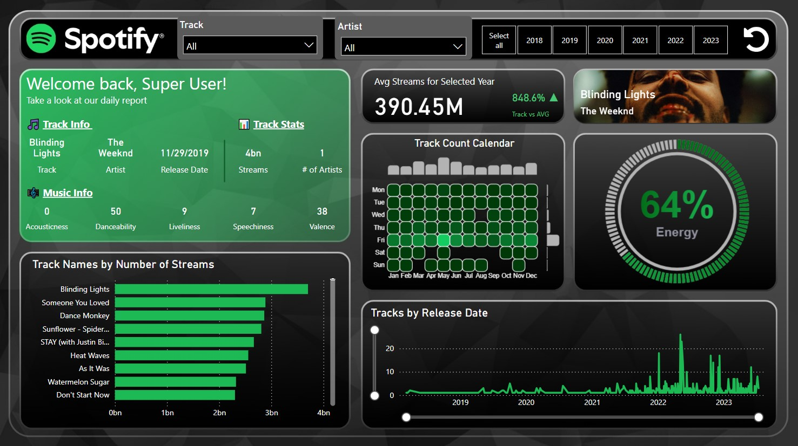

# Spotify Top Tracks (2018-2023) Insights

This interactive Power BI dashboard analyzes the most streamed tracks on Spotify from 2018 to 2023, providing a detailed breakdown of streaming trends, artist performance, and song characteristics over time. The project leverages a dataset enriched with Spotify cover art images using the Spotify API and Python, integrating HTML visuals and DENEB-based custom visualizations to create a dynamic and insightful user experience.

## Highlights include:

- **Track Insights:** Key metrics such as total streams, top tracks, and artist performance trends.
- **Trend Analysis:** Yearly streaming averages and growth rates compared against historical data.
- **Track Release Heatmap:** A custom DENEB visualization that shows how many tracks were released on specific days and months, offering insights into music release patterns over the years.
- **Track Attributes:** Analysis of song characteristics like energy, danceability, and valence, presented through intuitive visuals, including a circular gauge for attribute percentages.
- **User Engagement:** Interactivity features like filters for years, artists, and track selection to explore streaming patterns and insights dynamically.

#### Preview of Dashboard:

    

