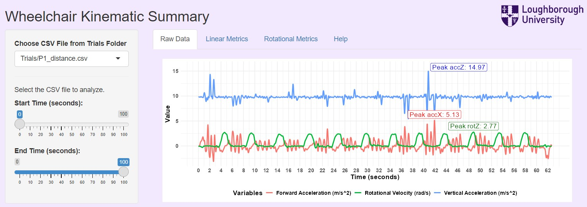
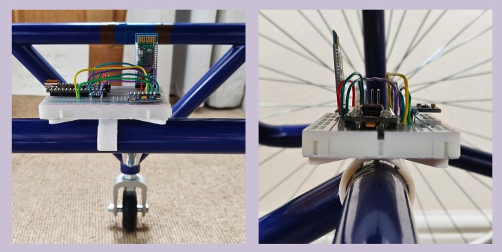

# Wheelchair Basketball Kinematics App

This project, completed as part of my undergraduate final-year research, involved designing an accessible, cost-effective sensor-based system specifically for wheelchair basketball athletes to monitor performance metrics relevant to their sport. I developed an accompanying R Shiny app that processes data from the system to calculate, display, and analyze key kinematic metrics. This enables athletes to track their performance, pinpoint areas for improvement, and tailor their training programs accordingly. The app serves as a practical tool for athletes to enhance training precision and achieve targeted performance goals.

**Supporting Docs:**
- [Poster](Final_Year_Project_Files/Poster.pdf)
- [Report](Final_Year_Project_Files/Report.pdf)
- [App](https://hl03zf-nick-shrimal.shinyapps.io/Wheelchair_Project/) - Click here to use the app I created!

## Tools Used:
- Sensor integration for accurate data capture
- Data preprocessing to clean and prepare raw sensor data
- Statistical analysis to derive meaningful insights
- Data visualization for an intuitive display of performance metrics
- R programming for app development, Shiny framework expertise for interactive data visualization, and UI/UX design to create a user-friendly interface.

**Preview of Dashboard:**

    

**Close-up of the designed sensor system attached to the wheelchair:**

    

