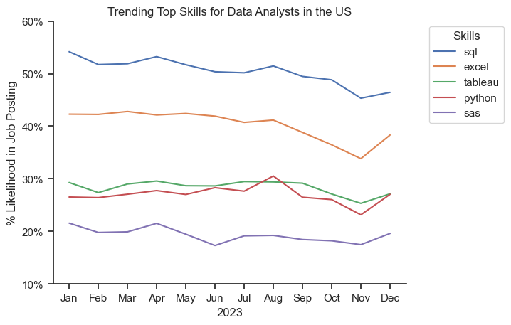
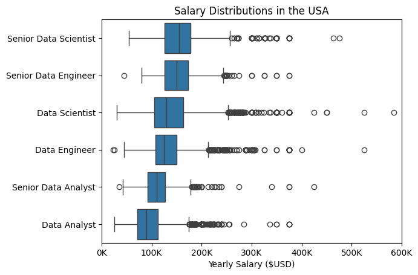
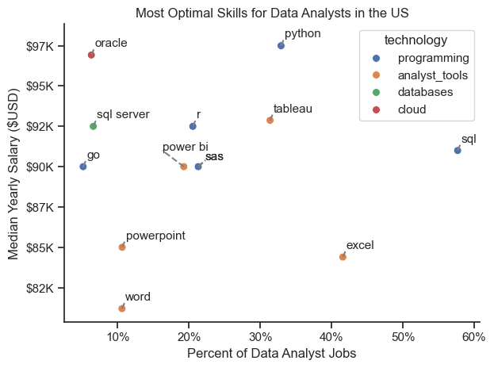
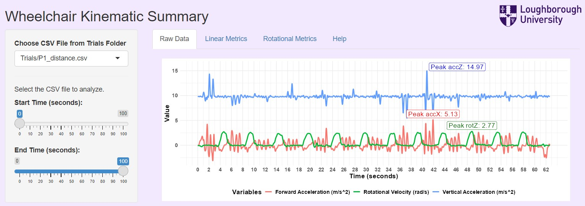
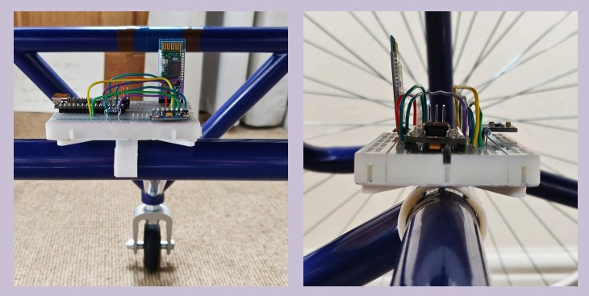

# Data Analytics Portfolio 

## About Me
Hey, I'm Nirav! I am a recent Sports Technology (BEng) graduate from Loughborough University, UK, with proficiency in data collection, analysis, and visualization using Python, R, SQL, Power BI, and Excel. I'm passionate about uncovering the story within data (because numbers have feelings too!) and presenting insights in impactful ways, all supported by a solid foundation in engineering principles.

This repository serves to showcase my skills and as a platform to share my projects, as well as to track my progress in Data Analytics and Data Science-related topics.

[Click Here!](Resume.pdf) to see my resume.

## Projects

*Note: Click each project title to view the full project, including code, visualizations, and detailed explanations of my analysis steps.*
<ins>
### [Project 1: Data Job Market Analysis](https://github.com/nshrimal11/Data_Job_Market_Project) 
</ins>

This project was created out of a desire to navigate and understand the job market more effectively as well as to aid me in my job search. It delves into top-paying and in-demand skills to help find optimal job opportunities for data analysts.

Below are the questions I answer in the project:

 - What are the most in-demand skills for the top 3 most popular data roles?
 - How are in-demand skills trending for Data Analysts?
 - How well do jobs and skills pay for Data Analysts?
 - What are the optimal skills for data analysts to learn?

    

    

    

    

### [Project 2: Wheelchair Basketball Kinematics App](https://hl03zf-nick-shrimal.shinyapps.io/Wheelchair_Project/) 

This project, completed as part of my undergraduate final-year research, involved designing an accessible, cost-effective sensor-based system specifically for wheelchair basketball athletes to monitor performance metrics relevant to their sport. I developed an accompanying R Shiny app that processes data from the system to calculate, display, and analyze key kinematic metrics. This enables athletes to track their performance, pinpoint areas for improvement, and tailor their training programs accordingly. The app serves as a practical tool for athletes to enhance training precision and achieve targeted performance goals.

This project required skills in **sensor integration** for accurate data capture, **data preprocessing** to clean and prepare raw sensor data, **statistical analysis** to derive meaningful insights, and **data visualization** for an intuitive display of performance metrics. Additionally, it involved **R programming** for app development, **Shiny framework** expertise for interactive data visualization, and UI/UX design to create a user-friendly interface.

Supporting Docs:
[Poster](Final_Year_Project_Files/Poster.pdf), 
[Report](Final_Year_Project_Files/Report.pdf),
[App](https://hl03zf-nick-shrimal.shinyapps.io/Wheelchair_Project/)

    

    

