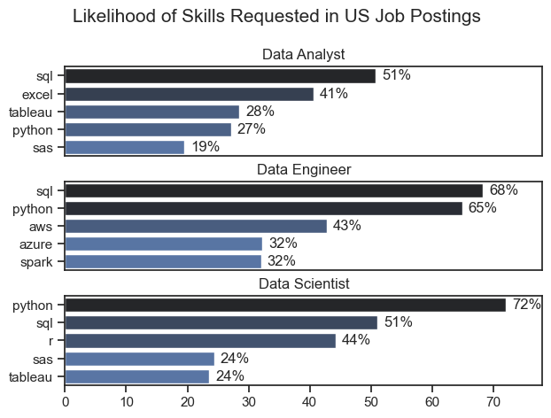

# Nirav Shrimal - Data Analytics Portfolio 

## About
Hey, I'm Nirav! I am a recent Sports Technology (BEng) graduate from Loughborough University, UK, with proficiency in data collection, analysis, and visualization using Python, R, SQL, Power BI, and Excel. Passionate about transforming complex data into actionable insights, with a solid foundation in engineering principles.

This repository serves to showcase my skills and as a platform to share my projects, as well as to track my progress in Data Analytics and Data Science-related topics.

## Projects

### [Project 1: Data Job Market Analysis](https://github.com/nshrimal11/Data_Job_Market_Project) 

This project was created out of a desire to navigate and understand the job market more effectively as well as to aid me in my job search. It delves into top-paying and in-demand skills to help find optimal job opportunities for data analysts.

Below are the questions I answer in my project:

 - What are the most in-demand skills for the top 3 most popular data roles?
 - How are in-demand skills trending for Data Analysts?
 - How well do jobs and skills pay for Data Analysts?
 - What are the optimal skills for data analysts to learn?

